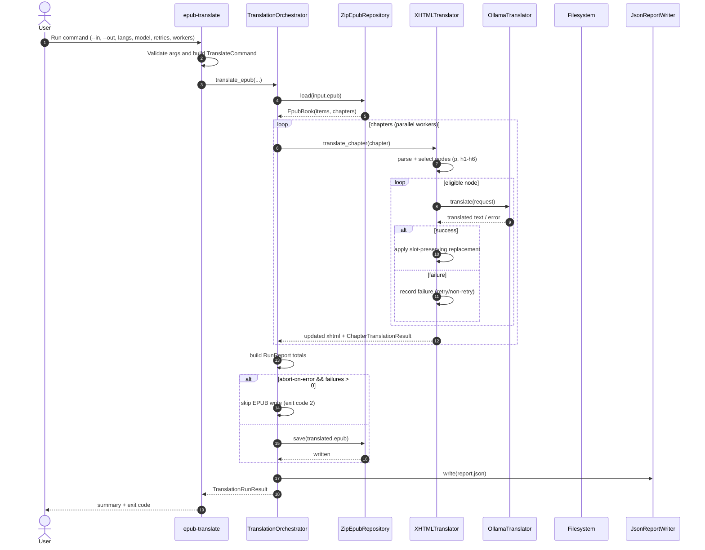

# epub-translator-cli

`epub-translator` translates EPUB chapter content with a local Ollama model while preserving original EPUB structure and
producing a detailed JSON run report.

## What The Project Does

- Loads EPUB archives and discovers chapter resources (`.xhtml`, `.html`, `.htm`).
- Translates **both paragraphs and headings** (`p`, `h1`-`h6`).
- Preserves inline formatting by redistributing translated text across original text/tail slots.
- Skips protected regions (`code`, `pre`, metadata sections) to avoid corrupting non-narrative content.
- Supports retry logic for transient provider failures.
- Writes translated EPUB plus `.report.json` diagnostics.
- Runs chapter translation in parallel (`--workers`) while preserving per-chapter context flow.
- Stages each translated chapter to a temporary workspace and merges into final EPUB only at the end.
- Supports resume for interrupted runs, including in-place mode when `--in` and `--out` are the same file.

---

## Architecture And Design Patterns

The codebase follows layered architecture:

- `domain`: immutable models, errors, and ports.
- `application`: orchestration use case (`TranslationOrchestrator`).
- `infrastructure`: adapters for EPUB IO, Ollama, logging, and reporting.

Patterns applied:

- **Facade**: `TranslationOrchestrator.translate_epub(...)` is the application entrypoint.
- **Strategy via Port**: translator/repository/report writer are protocol-driven adapters.
- **Command Object**: CLI validates input into immutable `TranslateCommand` before execution.
- **Pipeline Staging**: parse -> select nodes -> translate -> apply -> report -> write output.
- **Resilience pattern**: retry with exponential backoff for transient translation errors.

---

## Translation Scope And Safety Rules

### Translated tags

- `p`
- `h1`, `h2`, `h3`, `h4`, `h5`, `h6`

### Skipped/protected

- `code`, `pre`
- metadata/script/style containers (`head`, `title`, `style`, `script`)
- empty textual nodes

### Inline formatting preservation

The parser keeps markup stable by replacing text in-place using slot-aware distribution:

- `elem.text` and `child.tail` slots are collected in order,
- translated text is proportionally split,
- chunk assignment preserves ownership of inline styles and semantics.

This avoids flattening or losing spans/emphasis in translated output.

---

## End-to-End Pipeline

### 1) Pre-processing

- Parse chapter XHTML with entity normalization.
- Build chapter context snippet from chapter text (limited length).
- Select translatable nodes by configured tags.
- Determine skip reasons for protected/empty nodes.

### 2) Processing

For each eligible node:

- Build request with language/model/temperature/context/prior translations.
- Send prompt to Ollama translator adapter.
- Apply retries with exponential backoff on retryable failures.
- Sanitize model output to strip leaked prompt/context markers.
- Replace source node text while preserving inline formatting slots.

### 3) Post-processing

- Collect per-node changes/failures/skips into chapter reports.
- Persist each translated chapter snapshot in a run staging workspace.
- Merge staged chapter bytes back into EPUB item map only after all chapter tasks complete.
- Apply `--abort-on-error` policy:
    - if enabled and failures exist, skip EPUB write and return exit code `2`.
    - otherwise save translated EPUB.
- Write JSON report with aggregate totals.

### Resume behavior

If a run stops before final EPUB write, the translator keeps completed chapter snapshots in a deterministic temporary workspace near the report file. On the next run with the same translation signature (input/output path, model, languages, temperature, retries, context window), completed chapters are reused, while failed/incomplete chapters are translated again. This is especially useful for safe in-place retries (`--in` == `--out`) because only the final successful merge overwrites the EPUB.

Use `--reset-resume-state` to force a fresh run and discard any staged chapter snapshots before translation starts.

---

## Sequence Diagram



---

## Installation

```bash
python -m venv .venv
source .venv/bin/activate
pip install -U pip
pip install -e ".[dev]"
```

## CLI Usage

```bash
epub-translate \
  --in ./resources/input/sample1.epub \
  --out ./resources/output/sample1/sample1.italiano.epub \
  --source-lang en \
  --target-lang it \
  --model translategemma:4b \
  --temperature 0.2 \
  --retries 3 \
  --workers 4 \
  --context-paragraphs 3 \
  --log-level INFO
```

## CLI Flags

| Flag                   | Default                  | Description                                 |
|------------------------|--------------------------|---------------------------------------------|
| `--in`                 | required                 | Input EPUB path                             |
| `--out`                | required                 | Output translated EPUB path                 |
| `--source-lang`        | required                 | Source language label/code                  |
| `--target-lang`        | required                 | Target language label/code                  |
| `--model`              | required                 | Ollama model id                             |
| `--temperature`        | `0.2`                    | Generation temperature                      |
| `--retries`            | `3`                      | Retries per node for retryable failures     |
| `--report-out`         | `<out>.report.json`      | Optional custom report path                 |
| `--abort-on-error`     | `false`                  | Skip output EPUB write when failures remain |
| `--log-level`          | `INFO`                   | Logging level (`INFO`/`DEBUG`)              |
| `--ollama-url`         | `http://localhost:11434` | Ollama base URL                             |
| `--workers`            | `1`                      | Parallel chapter workers                    |
| `--context-paragraphs` | `3`                      | Rolling prior-translation context size      |
| `--reset-resume-state` | `false`                  | Clear staged resume workspace before run    |

---

## Output Artifacts

- Translated EPUB: path from `--out` (unless aborted by policy).
- Report JSON: `--report-out` or `<out>.report.json`.

Report includes:

- chapter sections,
- per-node changes,
- per-node failures with attempts and error type,
- skipped nodes with skip reason,
- aggregate totals.

---

## Exit Codes

- `0`: successful run.
- `1`: fatal CLI/runtime failure.
- `2`: translation finished with failures and `--abort-on-error` prevented EPUB write.

---

## Test

```bash
pytest -q tests/unit
```

