# EPUB Translator CLI — Architecture & Flow Documentation

## Overview

`epub-translator-cli` is a CLI tool that translates EPUB books paragraph-by-paragraph using a local
[Ollama](https://ollama.com) language model. It is structured around a clean hexagonal/ports-and-adapters
architecture with three layers: **domain**, **application**, and **infrastructure**.

The domain layer contains pure data models and port interfaces with no external dependencies.
The application layer holds the orchestration logic that drives a translation run, depending only on
domain ports rather than concrete implementations. The infrastructure layer provides the concrete
adapters: ZIP-based EPUB I/O, an lxml XHTML parser, an Ollama HTTP client, a filesystem staging
store, and a JSON report writer. The CLI is the composition root — it wires all adapters together
and calls the orchestrator.

---

## Layer Map

```
CLI (cli.py) — composition root, wires all adapters
  └─► Application
        ├─► TranslationOrchestrator
        │     ├─► EpubRepositoryPort  ──► ZipEpubRepository (+ OPFSpineParser)
        │     ├─► ChapterProcessorPort ──► ChapterTranslator
        │     │                               ├─► XHTMLTranslator (XHTML I/O only)
        │     │                               └─► TranslatorPort ──► OllamaTranslator
        │     │                                                           └─► PromptBuilderPort
        │     │                                                               ├─► PromptBuilder
        │     │                                                               └─► GlossaryAwarePromptBuilder
        │     ├─► ReportWriterPort    ──► JsonReportWriter
        │     └─► ChapterStageStorePort ──► FilesystemChapterStageStore
        └─► ChapterTranslator (implements ChapterProcessorPort)
```

---

## 1. High-Level Translation Flow

This diagram shows the full end-to-end journey of a translation run — from the user typing the
command on the terminal to the final EPUB file being written on disk. The CLI validates arguments
and wires up all infrastructure adapters, then hands control to the orchestrator. The orchestrator
loads the book, checks for chapters already translated in a previous (possibly crashed) run,
translates the remaining chapters in parallel, assembles the final report, and writes both the
translated EPUB and the JSON report. If everything succeeds it also clears the resume staging
workspace.

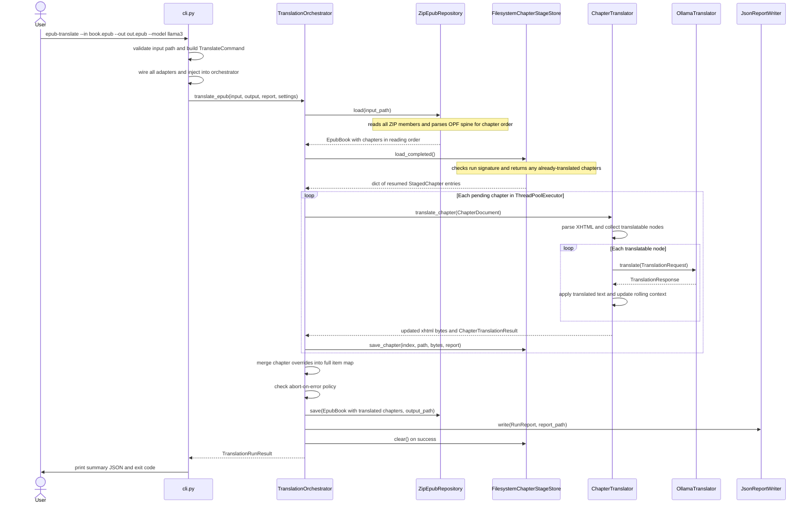

**Step-by-step walkthrough:**

- **`User → CLI`** — The user runs the `epub-translate` command with the required flags. Typer
  parses and validates all arguments into typed Python parameters.
- **`CLI → CLI: validate input path and build TranslateCommand`** — `_validate_input_path()` checks
  that the input file exists and is a regular file. `_build_command()` assembles an immutable
  `TranslateCommand` frozen dataclass, which includes the resolved report path (defaulting to a
  `.report.json` suffix next to the output file).
- **`CLI → CLI: wire all adapters`** — The CLI acts as the composition root. It instantiates every
  concrete infrastructure object: `OllamaTranslator` (with `settings` and `PromptBuilder`),
  `XHTMLTranslator`, `ChapterTranslator` (receives both), `FilesystemChapterStageStore.for_run()`
  and `ZipEpubRepository`. These are injected into the orchestrator typed as port interfaces, so
  the orchestrator has no knowledge of concrete classes.
- **`CLI → Orch: translate_epub(...)`** — Control transfers to the orchestrator. From this point
  the CLI simply waits for a `TranslationRunResult` to come back.
- **`Orch → Repo: load(input_path)`** — The repository opens the EPUB ZIP archive and reads every
  member into a `dict[str, bytes]`. It also records the original compression type of every entry
  so that images are not re-compressed on save.
- **`Repo → Orch: EpubBook`** — Returns the fully populated `EpubBook` containing the items dict,
  the chapters list in OPF spine order, and the compression types map. Chapter order is determined
  by parsing `META-INF/container.xml` to locate the OPF and then walking the `<spine>` element.
- **`Orch → Stage: load_completed()`** — The stage store is asked whether a previous (possibly
  crashed) run left any successfully translated chapters in its staging workspace.
- **`Stage → Orch: dict of resumed StagedChapter entries`** — Returns a dict mapping zero-based
  chapter index to `StagedChapter`. Chapters whose last run report recorded no failures are marked
  as completed and returned here. Chapters with failures are excluded so they will be re-translated.
  Returns an empty dict on a fresh run.
- **`Orch → CT: translate_chapter(ChapterDocument)`** — Each chapter *not* present in the resumed
  dict is submitted to the thread pool as a `_ChapterWork` unit. The thread pool calls
  `ChapterTranslator.translate_chapter()` concurrently up to `--workers` at a time.
- **`CT → CT: parse XHTML and collect translatable nodes`** — `XHTMLTranslator.parse_chapter()`
  normalises HTML entities, parses the XHTML with lxml in recover mode, runs an XPath query for
  all `<p>` and `<h1>`–`<h6>` elements, and returns the list of `(element, TranslatableNode)`
  pairs alongside the lxml root.
- **`CT → LLM: translate(TranslationRequest)`** — For each node that is not skipped, a
  `TranslationRequest` is built containing the text, rolling context pairs, chapter context, and
  glossary terms, then passed to `OllamaTranslator`.
- **`LLM → CT: TranslationResponse`** — The adapter sends the `/api/chat` HTTP request, sanitises
  the response, and returns the clean translated text wrapped in a `TranslationResponse`.
- **`CT → CT: apply translated text and update rolling context`** — The translated text is written
  back into the live lxml element tree via `replace_node_text`. A `NodeChange` entry is appended
  to the result. The `(source, translated)` pair is pushed into the rolling context deque so
  subsequent nodes in the same chapter can benefit from consistent terminology.
- **`CT → Orch: updated xhtml bytes and ChapterTranslationResult`** — After all nodes are
  processed, lxml serialises the modified tree to bytes. The `ChapterTranslationResult` carries the
  full list of changes, failures, and skips for this chapter.
- **`Orch → Stage: save_chapter(...)`** — The translated XHTML bytes and the per-chapter report are
  immediately written to the staging workspace with atomic `.tmp` renames. This ensures that a
  crash after this point will not require re-translating this chapter.
- **`Orch → Orch: merge chapter overrides`** — All translated chapter bytes (from the thread pool
  plus any resumed chapters) are merged into the original `EpubBook.items` dict, replacing only
  the chapter entries while leaving all other archive members (images, CSS, fonts) untouched.
- **`Orch → Orch: check abort-on-error policy`** — If `--abort-on-error` is set and at least one
  node failed across all chapters, the EPUB write is skipped and exit code `2` is used. The report
  is still written so the user can inspect which nodes failed.
- **`Orch → Repo: save(EpubBook, output_path)`** — Writes the updated EPUB as a new ZIP archive.
  `mimetype` is always first and uncompressed per the EPUB spec. All other entries use their
  original compression type.
- **`Orch → Report: write(RunReport, report_path)`** — Serialises the fully assembled `RunReport`
  (aggregate totals, per-chapter changes, failures, and skips) to a UTF-8 JSON file.
- **`Orch → Stage: clear()`** — On a successful write, the entire staging workspace directory is
  deleted. It is no longer needed since the output EPUB is complete.
- **`Orch → CLI: TranslationRunResult`** — Returns `output_written`, the total `failures` count,
  and the `exit_code` (0 = success, 2 = failures with output).
- **`CLI → User: print summary JSON and exit code`** — The CLI prints a JSON summary with
  `output_written`, `failures`, and elapsed duration, then raises `typer.Exit(code=result.exit_code)`.

---

## 2. Resume / Staging Flow

Every time a chapter finishes translating it is saved immediately to a hidden staging directory on
disk. The staging manifest records a *run signature* — a fingerprint of the input file path, output
path, model name, temperature, retries, workers, and language pair. If the process crashes
mid-run, the next invocation reads the manifest, verifies that the signature matches, and skips
every chapter that was already successfully translated. Chapters that failed are re-translated.
If the signature changed (different model, different input file) the workspace is wiped and a
fresh run starts. When the final EPUB is written the workspace is deleted entirely.

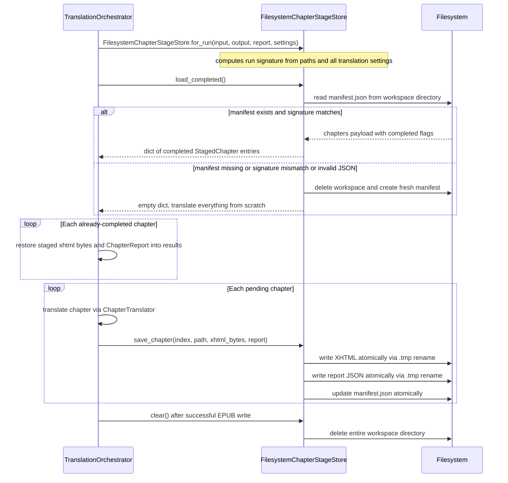

**Step-by-step walkthrough:**

- **`Orch → Stage: for_run(...)`** — Creates a stage store instance bound to this specific run.
  The run signature is computed as a dict containing the resolved absolute paths of input, output
  and report files, plus `source_lang`, `target_lang`, `model`, `temperature`, `retries`,
  `context_paragraphs`, `workers`, the input file size, and its mtime nanoseconds. Any change to
  these values will produce a different signature and invalidate the cached workspace.
- **`Orch → Stage: load_completed()`** — Asks the store to return chapters that can safely be
  skipped in this run because they were successfully translated before.
- **`Stage → FS: read manifest.json`** — Looks for the manifest file inside the hidden
  `.{report_name}.chapter-stage/` directory next to the report path. The manifest is a JSON file
  containing the stored signature and a `chapters` dict.
- **`FS → Stage: chapters payload`** *(happy path)* — The manifest JSON is loaded and the stored
  `signature` key is compared field-by-field with the current run's signature.
- **`Stage → Orch: dict of completed StagedChapter entries`** — Only chapters whose manifest entry
  has `"completed": true` are loaded from disk (reading the staged XHTML bytes and deserialising
  the JSON report), and returned. Chapters with `"completed": false` (those that had failures) are
  excluded so they will be retried.
- **`Stage → FS: delete workspace and create fresh manifest`** *(unhappy path)* — If the manifest
  file is absent, the JSON is corrupt, or the signature does not match, `shutil.rmtree` removes
  the entire workspace and a new empty manifest is written. The run starts with zero resumed
  chapters.
- **`Stage → Orch: empty dict`** — All chapters will be translated from scratch.
- **`Orch → Orch: restore staged xhtml bytes and ChapterReport`** — For every resumed chapter, its
  pre-translated bytes are inserted into the `updated_items` dict and its `ChapterReport` is placed
  into the `chapter_reports` list at the correct index — exactly as if the chapter had just been
  translated in the current run. The thread pool will not submit work for these chapters.
- **`Orch → Stage: save_chapter(...)`** — Called immediately after each chapter finishes
  translating, inside the `as_completed` loop. The chapter is persisted before moving to the next
  one, so a crash after N chapters completes means only chapter N+1 needs to be retranslated.
- **`Stage → FS: write XHTML atomically`** — The bytes are written to
  `chapters/{index:05d}.xhtml.tmp` then renamed to `chapters/{index:05d}.xhtml`. Because a
  filesystem rename within the same directory is atomic on POSIX systems, a crash mid-write leaves
  a `.tmp` file that is silently ignored on the next load.
- **`Stage → FS: write report JSON atomically`** — Same atomic pattern for
  `reports/{index:05d}.json`.
- **`Stage → FS: update manifest.json`** — The manifest `chapters` dict is updated with the new
  entry (including `"completed": not bool(report.failures)`) and written atomically.
- **`Orch → Stage: clear()`** — Called only after `ZipEpubRepository.save()` returns successfully.
  If `save()` throws, the workspace is preserved so the next run can resume.
- **`Stage → FS: delete entire workspace directory`** — `shutil.rmtree` with `ignore_errors=True`
  removes the workspace. The run is considered complete.

---

## 3. Node Translation with Retry and Backoff

Every paragraph or heading that passes the skip check goes through this retry loop inside
`ChapterTranslator`. A `TranslationRequest` is built with the node's text, the chapter context
snippet, the rolling window of recent source→translation pairs, and the glossary terms. The request
goes to `OllamaTranslator`, which builds the two-part prompt and posts it to Ollama's `/api/chat`
endpoint. Server errors and network problems are retried with exponential backoff. Client errors
abort immediately. After a successful translation the result is validated and written back into the
lxml tree.

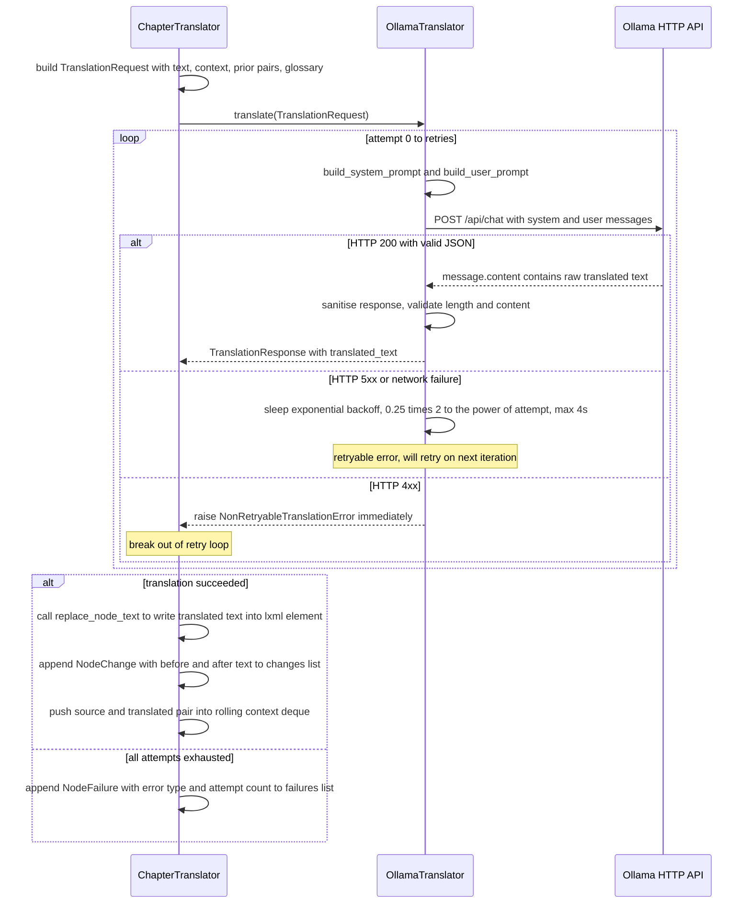

**Step-by-step walkthrough:**

- **`CT → CT: build TranslationRequest`** — Assembles the per-node request object. `chapter_context`
  is the 1500-character multi-point sample of the chapter text (computed once at parse time).
  `prior_translations` is the formatted rolling window of up to N recent `Original: ...\nTranslation: ...`
  pairs from the same chapter. `glossary_terms` is the dict loaded from the `--glossary` file, or
  an empty dict if no glossary was provided.
- **`CT → LLM: translate(TranslationRequest)`** — Passes the full request to the translator
  adapter. The adapter owns the retry loop; `ChapterTranslator` sees only the final success or
  failure.
- **`LLM → LLM: build prompts`** *(each attempt)* — On every attempt the prompt is rebuilt from
  scratch by calling `prompt_builder.build_system_prompt(self.settings)` and
  `prompt_builder.build_user_prompt(request)`. This is necessary so that if the model is swapped
  between attempts (which cannot happen in practice but is architecturally clean) the correct
  prompt is always used.
- **`LLM → Ollama: POST /api/chat`** — The HTTP request body contains `model`, `stream: false`,
  `options: {temperature}`, and `messages: [{role: system, content: ...}, {role: user, content: ...}]`.
  Ollama processes both roles separately, which leads to better instruction-following than a
  concatenated single-prompt approach.
- **`Ollama → LLM: message.content`** *(HTTP 200)* — Ollama returns a JSON object where the
  translation lives at `payload["message"]["content"]`.
- **`LLM → LLM: sanitise and validate`** — `_sanitise_response()` strips any surrounding quote
  characters added by the model, strips any echoed fence blocks (`<<<...>>>`), and strips any
  echoed prompt markers (`TEXT TO TRANSLATE:`). It then raises `RetryableTranslationError` if the
  result is empty, contains HTML tag characters (`<` followed by a word character), or is more than
  3× the source length.
- **`LLM → CT: TranslationResponse`** — The clean, validated translated text is returned.
- **`LLM → LLM: sleep exponential backoff`** *(HTTP 5xx or network error)* — `RetryableTranslationError`
  is raised by the transport layer. The loop sleeps for `BACKOFF_BASE * 2^attempt` seconds (0.25 s,
  0.5 s, 1 s, 2 s, 4 s) and then retries. The sleep is capped at `BACKOFF_CAP_SECONDS = 4.0` to
  prevent excessively long delays on later attempts.
- **`LLM → CT: raise NonRetryableTranslationError`** *(HTTP 4xx)* — Client errors (e.g. the
  requested model does not exist, or the request is malformed) cannot succeed on a retry. The loop
  breaks immediately without sleeping.
- **`CT → CT: replace_node_text`** *(success path)* — Calls
  `self.xhtml_parser.replace_node_text(elem, translated)` which distributes the translated string
  across the inline text slots of the lxml element, preserving dropcaps and emphasis markup.
- **`CT → CT: append NodeChange`** — Records `before` (the original source text truncated to 200
  characters) and `after` (the translated text truncated to 200 characters) as a `NodeChange`
  frozen dataclass for inclusion in the chapter report.
- **`CT → CT: push pair into rolling context deque`** — The `(source_text, translated)` pair is
  appended to a `deque(maxlen=context_paragraphs)`. Older entries are automatically discarded.
  The deque is formatted into the `prior_translations` string for the next node's request.
- **`CT → CT: append NodeFailure`** *(failure path)* — If every attempt raised an exception, a
  `NodeFailure` is recorded with the error class name, error message, and number of attempts. The
  node's source text remains untouched in the lxml tree so the output EPUB still has readable
  content in that position.

---

## 4. XHTML Node Processing Pipeline

`XHTMLTranslator` is responsible purely for XHTML I/O — it has no knowledge of LLM calls or
retry logic. When asked to parse a chapter, it normalises the bytes, parses them with lxml, and
collects the translatable elements as typed value objects. After `ChapterTranslator` has applied
all translations back to the lxml tree, `XHTMLTranslator` serialises the tree back to UTF-8 bytes,
preserving every attribute, class name, and inline element exactly as it was in the original.

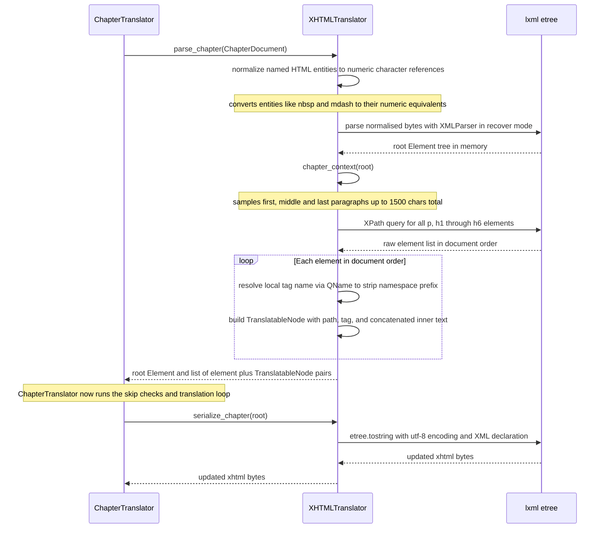

**Step-by-step walkthrough:**

- **`CT → XT: parse_chapter(ChapterDocument)`** — `ChapterTranslator` passes the raw `xhtml_bytes`
  from the EPUB archive to the XHTML parser. The `ChapterDocument` also carries the internal
  archive path, used later as the `chapter_path` in every node's identity.
- **`XT → XT: normalize named HTML entities`** — Named HTML entities such as `&nbsp;`, `&mdash;`,
  `&ldquo;`, `&rdquo;`, and `&hellip;` are valid in HTML but undefined in XML. lxml's XML parser
  would reject them. A simple byte-level `replace()` loop converts them to numeric character
  references (`&#160;`, `&#8212;`, `&#8220;`, `&#8221;`, `&#8230;`) before parsing.
- **`XT → lxml: parse normalised bytes`** — `etree.XMLParser(recover=True, resolve_entities=True)`
  is used so that minor EPUB XHTML violations (unclosed tags, unescaped ampersands that were missed
  by normalisation) do not crash the run. The recovered tree may silently discard or fix minor
  malformations, which is acceptable because the output will be serialised from the same tree.
- **`lxml → XT: root Element`** — The parsed root `_Element` is the live in-memory document tree.
  All XPath queries and text replacements will operate on this object directly.
- **`XT → XT: chapter_context(root)`** — Runs a second XPath query for `<p>` elements to gather
  paragraph texts. It selects the first, the middle (index `n//2`), and the last paragraph, joins
  them with `[...]` separators to signal discontinuity to the model, and truncates the result to
  `CHAPTER_CONTEXT_MAX_CHARS = 1500`. This context is passed with every `TranslationRequest` in
  the chapter as a tone and terminology hint for the LLM, not as text to translate.
- **`XT → lxml: XPath query`** — The query uses `local-name()` predicates so that XHTML namespace
  prefixes do not prevent matching. For example, `{http://www.w3.org/1999/xhtml}p` matches via
  `local-name()='p'`. All six heading levels and paragraphs are covered.
- **`lxml → XT: raw element list`** — Returns a Python list of `_Element` objects in document
  order. The XPath result type is checked with `isinstance(result, list)` before iteration to
  satisfy mypy's strict typing (lxml XPath can return non-list types for some query forms).
- **`XT → XT: resolve local tag name via QName`** *(per element)* — `etree.QName(elem.tag).localname`
  strips the namespace URI prefix from the tag string, giving the bare local name (`p`, `h1`, etc.).
  Elements with non-string tags (comments, processing instructions) are skipped.
- **`XT → XT: build TranslatableNode`** — Creates an immutable frozen dataclass containing
  `chapter_path` (archive path), `node_path` (XPath address like `/html/body/p[3]` from
  `getroottree().getpath(elem)`), `tag` (the local tag name), and `source_text` (all descendant
  text concatenated via `itertext()` and stripped). The node path is used in reports and logs to
  uniquely identify the node.
- **`XT → CT: root Element and node pairs`** — Returns both the live root (needed for in-place
  modification and serialisation) and the typed node list. `ChapterTranslator` will iterate the
  node list, skip or translate each node, and call `replace_node_text` on the matching elements.
- **`CT → XT: serialize_chapter(root)`** — Called after `ChapterTranslator` finishes the entire
  node loop and has applied all text replacements to the in-memory tree.
- **`XT → lxml: etree.tostring(...)`** — Serialises the root element tree to bytes with
  `encoding="utf-8"` and `xml_declaration=True`. All attributes (`class`, `id`, `href`, `style`)
  are preserved as-is. Only the `.text` and `.tail` string attributes of translatable elements were
  modified; everything else in the tree is unchanged.
- **`XT → CT: updated xhtml bytes`** — The final byte string is returned to `ChapterTranslator`,
  which passes it to the orchestrator for inclusion in the output EPUB and for staging.

---

## 5. Inline Text Slot Distribution

A paragraph in an EPUB is rarely a flat string. It often contains inline elements such as a
`<span class="dropcap">` for an ornamental first letter, `<em>` for emphasis, or `<a>` for a
hyperlink. In lxml each element has a `.text` attribute (the text before its first child) and a
`.tail` attribute (the text immediately following the element's closing tag). These are the *text
slots*. When the translated string is assigned back, it must be split across the same slots so that
the markup structure is preserved exactly. A special rule handles dropcap spans (a single-character
first slot) to guarantee they always receive exactly one character regardless of proportional
calculations.

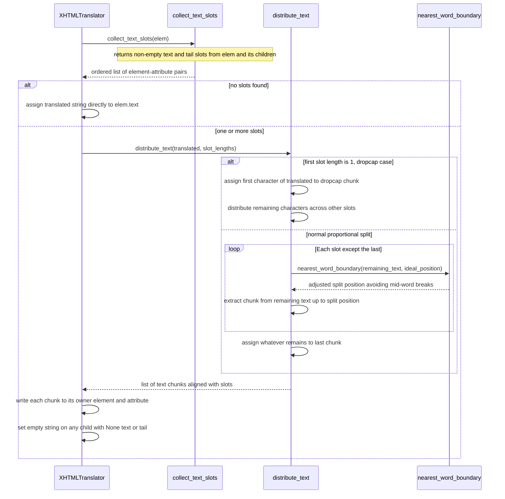

**Step-by-step walkthrough:**

- **`XT → CS: collect_text_slots(elem)`** — Scans the paragraph element for every non-empty text
  region. It checks `elem.text` (the text before the first child), and then for each immediate
  child element it checks `child.text` (text inside the child) and `child.tail` (text after the
  child's closing tag). Comment nodes, entity nodes, and processing instructions are excluded
  because their text attributes are read-only in lxml. Only non-empty (truthy) slots are included.
- **`CS → XT: ordered list of element-attribute pairs`** — Returns a list of `(element, "text")`
  or `(element, "tail")` tuples in document order. For a plain `<p>Hello world</p>` this is
  `[(p, "text")]`. For `<p><span>I</span>t is a fact</p>` this is `[(span, "text"), (span, "tail")]`.
- **`XT → XT: assign directly to elem.text`** *(no slots)* — If the element has no text-bearing
  children (pure text paragraph), the entire translated string is assigned to `elem.text` directly.
  No distribution is needed.
- **`XT → DT: distribute_text(translated, slot_lengths)`** *(has slots)* — The full translated
  string must be divided. `slot_lengths` is built from `len(getattr(owner, attr) or "")` for each
  slot, capturing the original character length of each region to guide proportional splitting.
- **`DT → DT: dropcap case`** *(first slot length is 1)* — If the first slot is exactly one
  character (the dropcap letter), the very first character of the translated string is assigned to
  that slot unconditionally. This prevents the proportional algorithm from computing a near-zero
  ideal length for the dropcap slot due to the extreme 1:N ratio. The function then recurses on the
  remaining `slot_lengths[1:]` with `translated[1:]`.
- **`DT → WB: nearest_word_boundary(remaining_text, ideal_position)`** *(proportional)* — For each
  slot except the last, the ideal split position is `round(len(remaining) * weight / remaining_weight)`.
  `nearest_word_boundary` then scans forward and backward from that position to find the nearest
  whitespace character, and returns whichever direction requires fewer steps, breaking ties in
  favour of the forward direction.
- **`WB → DT: adjusted split position`** — The character index at which the string will be split.
  Guaranteed to land on or after a whitespace character, so no word is cut mid-token.
- **`DT → DT: extract chunk`** — `remaining[:split_pos]` becomes the chunk for this slot.
  `remaining` advances to `remaining[split_pos:]` and `remaining_weight` decreases by `weight`.
- **`DT → DT: assign remainder to last chunk`** — The last slot always receives whatever text is
  left after all other splits, so no characters are dropped regardless of rounding.
- **`DT → XT: list of text chunks`** — A list of strings, one per slot, in the same order as the
  `slots` list returned by `collect_text_slots`.
- **`XT → XT: write each chunk`** — `setattr(owner, attr, chunk)` writes each chunk back into
  its owning element. For example, `setattr(span, "tail", " is a fact.")` sets the text that
  follows the `</span>` closing tag.
- **`XT → XT: set empty string on None text/tail`** — lxml serialises `None` text/tail as a
  self-closing tag (`<span/>`). Setting them to `""` forces the full open/close form
  (`<span></span>`), which is required by the XHTML DTD and expected by all EPUB readers.

---

## 6. EPUB Load and Save

An EPUB file is a ZIP archive with specific structural requirements. The repository reads every
file into memory, determines chapter reading order from the OPF package document, and returns an
in-memory `EpubBook`. On save it reassembles the archive, placing `mimetype` first and uncompressed
as the spec requires, and restoring the original compression mode for every other entry so
pre-compressed binary assets like JPEG images are not re-compressed.

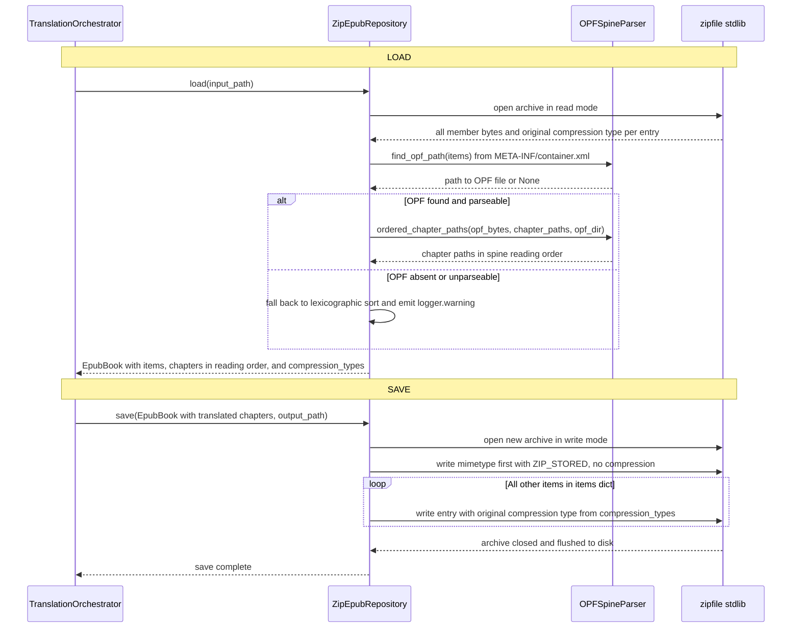

**Step-by-step walkthrough:**

- **`Orch → Repo: load(input_path)`** — The orchestrator delegates all file I/O to the repository
  adapter, which wraps the call in a try/except and re-raises any exception as `EpubReadError`.
- **`Repo → ZIP: open archive`** — `zipfile.ZipFile(input_path, "r")` opens the EPUB. The code
  iterates `archive.infolist()` (not `namelist()`) so that both the bytes and the `ZipInfo`
  metadata are accessible in a single pass.
- **`ZIP → Repo: all member bytes and compression types`** — Each member's bytes are stored in a
  `dict[str, bytes]` keyed by the member's internal filename. The `ZipInfo.compress_type` integer
  (e.g. `zipfile.ZIP_STORED = 0`, `zipfile.ZIP_DEFLATED = 8`) is stored in a parallel
  `dict[str, int]`.
- **`Repo → OPF: find_opf_path(items)`** — Looks for `META-INF/container.xml` in the items dict.
  If found, parses it with lxml using a `local-name()='rootfile'` XPath and extracts the
  `full-path` attribute, which gives the path to the OPF package document (e.g. `OEBPS/content.opf`).
- **`OPF → Repo: path or None`** — Returns the OPF path string, or `None` if the container XML is
  absent, unparseable, or lacks the `full-path` attribute.
- **`Repo → OPF: ordered_chapter_paths(...)`** *(OPF found)* — Parses the OPF XML to build a
  `manifest id → resolved archive path` mapping, then iterates the `<spine>` `<itemref>` elements
  in order. For each `idref` it resolves the `href` relative to the OPF directory using
  `posixpath.normpath(posixpath.join(opf_dir, href))`. Only paths actually present in the archive
  are included in the result.
- **`OPF → Repo: spine-ordered path list`** — The list of chapter paths exactly as the EPUB author
  defined the reading order.
- **`Repo → Repo: lexicographic fallback`** *(OPF absent)* — `sorted(..., key=lambda d: d.path)`
  is used as a best-effort fallback. A `logger.warning` message is emitted so the user is aware
  that spine order could not be determined.
- **`Repo → Orch: EpubBook`** — The fully populated book object contains the items dict
  (all archive members), the ordered chapters list (only the chapter `.xhtml`/`.html` members,
  in reading order), and the compression types dict.
- **`Orch → Repo: save(...)`** *(after translation)* — Called only if the abort-on-error check
  passes. Any exception is caught and re-raised as `EpubWriteError`.
- **`Repo → ZIP: write mimetype first with ZIP_STORED`** — The EPUB spec (OPS 2.0.1 §2.3) requires
  that `mimetype` is the very first file in the ZIP and is stored without compression and without
  extra ZIP fields. This allows tools to identify an EPUB by reading just the first 38 bytes of the
  file.
- **`Repo → ZIP: write each entry with original compression`** *(loop)* —
  `book.compression_types.get(name, zipfile.ZIP_DEFLATED)` looks up the original mode for each
  item. JPEG and PNG images are typically stored as `ZIP_STORED` (since those formats are already
  compressed); text resources use `ZIP_DEFLATED`. Re-using the original modes makes the output
  archive byte-faithful for all non-translated assets.
- **`ZIP → Repo: archive closed`** — Python's `with` block on `ZipFile` flushes and closes the
  archive when it exits, ensuring all data is written before the function returns.

---

## 7. Prompt Construction

The translator uses the Ollama `/api/chat` endpoint, which accepts separate `system` and `user`
role messages. `PromptBuilder` (or `GlossaryAwarePromptBuilder` when a glossary file is provided)
splits the prompt into these two parts. The system prompt is stable across the entire run and
contains the persona and all language rules. The user prompt varies per node and carries the
context, rolling translation memory, and the text to translate.

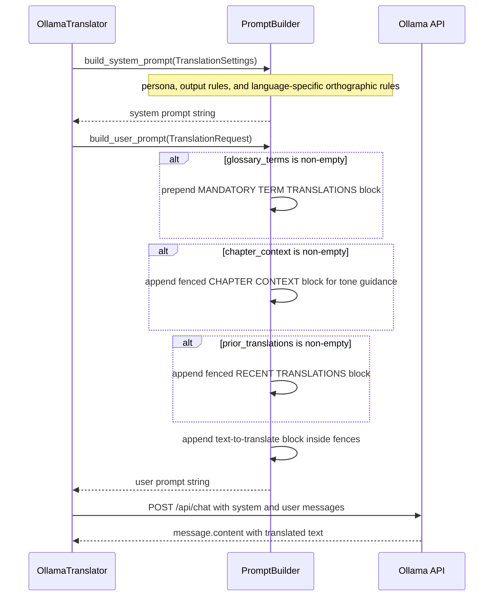

**Step-by-step walkthrough:**

- **`LLM → PB: build_system_prompt(TranslationSettings)`** — Called once per `translate()` call.
  Receives the full `TranslationSettings` (not the `TranslationRequest`) because the system prompt
  depends on run-wide settings like `source_lang` and `target_lang`, not on the individual node's
  content.
- **`PB: persona line`** — Opens with *"You are a professional book translator from {src} to {tgt}."*
  where language names are resolved from BCP-47 codes via `_LANGUAGE_NAMES` (e.g. `"it"` →
  `"Italian"`).
- **`PB: output rules block`** — Lists strict output constraints: output only the translation with
  no labels, commentary, or repeated instructions; preserve meaning, tone, and punctuation; do not
  drop sentence-ending punctuation.
- **`PB: language-specific rules`** — `_target_language_rules(settings.target_lang)` looks up
  `_LANGUAGE_RULES` for the target language code. For Italian (`"it"`): distinction between grave
  (`è`) and acute (`é`) accents with explicit error examples, realistic 5–15% length expansion
  guidance, apostrophe elision rules (`l'uomo` vs `un uomo`), no space before `:;!?`, lowercase
  months and days, guillemets `«…»` for dialogue, and pronoun/honorific capitalisation rules.
  French, German, Spanish, and Portuguese have analogous rule sets.
- **`PB → LLM: system prompt string`** — The complete, immutable system message for this run.
- **`LLM → PB: build_user_prompt(TranslationRequest)`** — Receives the per-node content fields.
- **`PB: MANDATORY TERM TRANSLATIONS block`** *(glossary non-empty)* — `GlossaryAwarePromptBuilder`
  prepends a block formatted as `term -> translation` lines. The heading explicitly says *"always
  use these exact translations"* so the model does not paraphrase character names or invented words.
  This block is skipped entirely when `glossary_terms` is empty, and `PromptBuilder` never
  generates it (it ignores the glossary field).
- **`PB: CHAPTER CONTEXT block`** *(chapter_context non-empty)* — The 1500-character sampled
  context is placed inside `<<<`/`>>>` fences under the heading *"CHAPTER CONTEXT (for
  tone/terminology guidance only — do NOT reproduce this in your response)"*. The explicit
  instruction discourages the model from echoing this block as part of the translation.
- **`PB: RECENT TRANSLATIONS block`** *(prior_translations non-empty)* — The rolling window of
  `Original: ...\nTranslation: ...` pairs from recent nodes in the same chapter is placed inside
  `<<<`/`>>>` fences under a similar do-not-reproduce heading. This helps the model maintain
  consistent rendering of recurring phrases and character names within a chapter.
- **`PB: text-to-translate block`** — The node's `source_text` is placed inside `<<<`/`>>>` fences
  under the label *"Translate the following text:"*. The fences make it visually unambiguous where
  the source text starts and ends, and the `_FENCE_RE` regex in `ChapterTranslator` strips any
  fence characters that a model might accidentally echo back.
- **`PB → LLM: user prompt string`** — The assembled user message, which varies with every node
  translated.
- **`LLM → Ollama: POST /api/chat`** — The request body carries `"messages": [{"role": "system",
  "content": system_prompt}, {"role": "user", "content": user_prompt}]` plus `model`, `stream:
  false`, and `options: {temperature}`. The chat format means instruction-tuned models (Llama 3,
  Mistral, Phi-3) treat the rules as a system-level directive, not as part of the text to process.
- **`Ollama → LLM: message.content`** — The model's response is extracted from
  `payload["message"]["content"]`. An empty string here triggers `RetryableTranslationError`.

---

## 8. Class Diagram — Domain Models

The domain layer holds all pure data classes. Every class is an immutable frozen dataclass — no
methods that mutate state, no external dependencies. `TranslationSettings` captures the full
runtime configuration for one run. `TranslationRequest` carries only the per-node content fields
(the text to translate, context, and glossary terms); settings fields like model name and
temperature are held by the translator adapter, not repeated here. `ChapterReport` and `RunReport`
use tuples rather than lists so they cannot be mutated after construction. `Glossary` provides a
term-to-translation dictionary loaded from an external file.

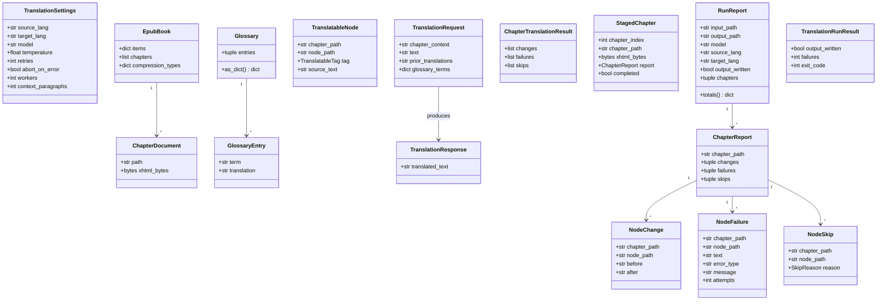

---

## 9. Class Diagram — Ports (Interfaces)

Ports are Python `Protocol` classes that define the contract each infrastructure adapter must
satisfy. Because they are structural protocols (duck typing), no inheritance is required — any
class that provides the right methods satisfies the port. This makes it trivial to swap
implementations: replace `ZipEpubRepository` with a cloud storage adapter, or replace
`OllamaTranslator` with an `AnthropicTranslator`, without touching a single line of orchestration
or application code.

```mermaid
classDiagram
    class EpubRepositoryPort {
        <<Protocol>>
        +load(input_path Path) EpubBook
        +save(book EpubBook, output_path Path) None
    }

    class TranslatorPort {
        <<Protocol>>
        +translate(request TranslationRequest) TranslationResponse
    }

    class ReportWriterPort {
        <<Protocol>>
        +write(report RunReport, report_path Path) None
    }

    class ChapterStageStorePort {
        <<Protocol>>
        +load_completed() dict
        +save_chapter(chapter_index, chapter_path, xhtml_bytes, report) None
        +clear() None
    }

    class PromptBuilderPort {
        <<Protocol>>
        +build_system_prompt(settings TranslationSettings) str
        +build_user_prompt(request TranslationRequest) str
    }

    class ChapterProcessorPort {
        <<Protocol>>
        +translate_chapter(chapter ChapterDocument) tuple
    }

    class GlossaryPort {
        <<Protocol>>
        +load(path Path) Glossary
    }
```

---

## 10. Class Diagram — Infrastructure

Infrastructure adapters are the concrete implementations behind the ports. `ZipEpubRepository`
reads and writes ZIP archives, delegating chapter ordering to `OPFSpineParser`. `OllamaTranslator`
drives the HTTP conversation with the Ollama server using the `/api/chat` endpoint. `XHTMLTranslator`
is a pure XHTML I/O utility with no LLM knowledge. `FilesystemChapterStageStore` provides atomic
chapter persistence with run signature validation.

```mermaid
classDiagram
    class ZipEpubRepository {
        +load(input_path Path) EpubBook
        +save(book EpubBook, output_path Path) None
        -_read_archive_items(path) tuple
        -_chapter_documents(items) list
        -_write_archive_items(book, path) None
    }

    class OPFSpineParser {
        +find_opf_path(items dict) str
        +ordered_chapter_paths(opf_bytes, all_paths, opf_path) list
    }

    class OllamaTranslator {
        +TranslationSettings settings
        +str base_url
        +float timeout_s
        +PromptBuilderPort prompt_builder
        +translate(request TranslationRequest) TranslationResponse
        -_chat_payload(request) dict
        -_post_chat(payload) Response
        -_validate_response_status(resp) None
        -_response_text(payload) str
    }

    class PromptBuilder {
        +build_system_prompt(settings TranslationSettings) str
        +build_user_prompt(request TranslationRequest) str
        -_context_block(context str) str
        -_prior_translations_block(prior str) str
    }

    class GlossaryAwarePromptBuilder {
        +build_system_prompt(settings TranslationSettings) str
        +build_user_prompt(request TranslationRequest) str
        -_glossary_block(glossary_terms dict) str
    }

    class TomlGlossaryLoader {
        +load(path Path) Glossary
    }

    class JsonGlossaryLoader {
        +load(path Path) Glossary
    }

    class JsonReportWriter {
        +write(report RunReport, path Path) None
    }

    class XHTMLTranslator {
        +tuple translatable_tags
        +parse_chapter(chapter ChapterDocument) tuple
        +serialize_chapter(root Element) bytes
        +chapter_context(root Element) str
        +replace_node_text(elem Element, translated str) None
        -_parse_root(xhtml_bytes bytes) Element
        -_candidate_nodes(root, chapter_path) list
    }

    class FilesystemChapterStageStore {
        +Path workspace_dir
        +dict signature
        +load_completed() dict
        +save_chapter(index, path, xhtml_bytes, report) None
        +clear() None
        +for_run(input, output, report, settings) FilesystemChapterStageStore
    }

    ZipEpubRepository ..|> EpubRepositoryPort : implements
    ZipEpubRepository --> OPFSpineParser : uses
    OllamaTranslator ..|> TranslatorPort : implements
    OllamaTranslator --> PromptBuilderPort : uses
    PromptBuilder ..|> PromptBuilderPort : implements
    GlossaryAwarePromptBuilder ..|> PromptBuilderPort : implements
    TomlGlossaryLoader ..|> GlossaryPort : implements
    JsonGlossaryLoader ..|> GlossaryPort : implements
    JsonReportWriter ..|> ReportWriterPort : implements
    FilesystemChapterStageStore ..|> ChapterStageStorePort : implements
```

---

## 11. Class Diagram — Application Layer

`TranslationOrchestrator` is the application facade. It accepts all its dependencies as constructor
fields typed as ports, giving it zero infrastructure imports. `ChapterTranslator` also lives in the
application layer because it encapsulates application-level concerns: the per-node loop, skip
detection, retry policy, rolling context management, and result assembly. It delegates XHTML I/O
to `XHTMLTranslator` (infrastructure) and LLM calls through `TranslatorPort`. The CLI is the
composition root that instantiates all concrete adapters and injects them.

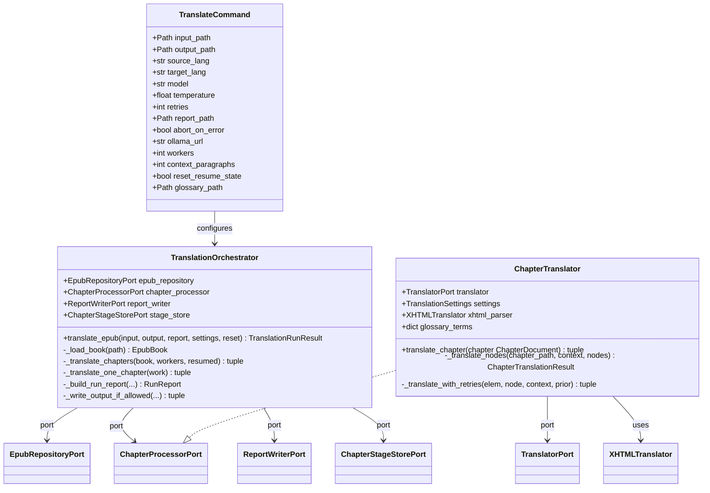

---

## 12. Error Hierarchy

There are two main branches. `EpubReadError` and `EpubWriteError` wrap any exception that occurs
during ZIP archive I/O. `TranslationError` covers failures from the LLM adapter:
`RetryableTranslationError` (network errors, server 5xx, empty or HTML-injected responses, and
excessively long outputs) triggers the exponential backoff retry loop inside `ChapterTranslator`;
`NonRetryableTranslationError` (client 4xx) breaks out of the loop immediately without sleeping.

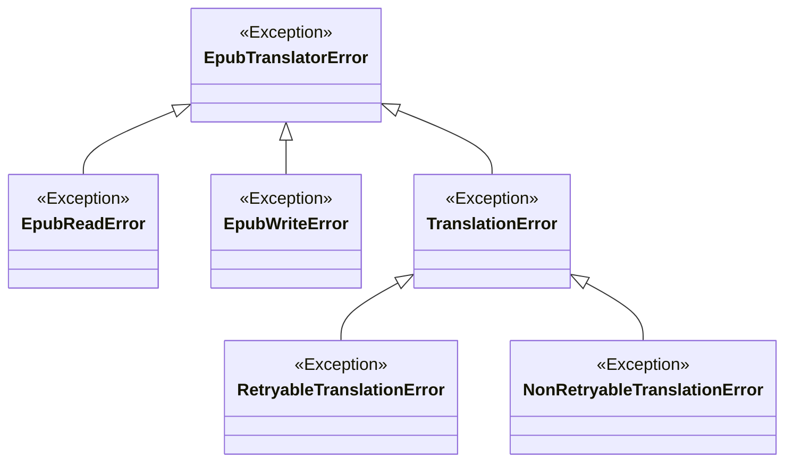

---

## 13. Data Flow Summary

```
[EPUB file on disk]
    │
    ▼ ZipEpubRepository.load()
    │   reads all ZIP entries + original compression types
    │   parses OPF spine for reading order
    │
[EpubBook]
    │   items: dict[archive_path → bytes]
    │   chapters: [ChapterDocument, ...] in spine order
    │   compression_types: dict[archive_path → int]
    │
    ▼ ChapterTranslator.translate_chapter()  (one per chapter, parallelised)
    │
    │   XHTMLTranslator.parse_chapter()
    │   ├── normalise named HTML entities → lxml parse in recover mode
    │   └── collect (element, TranslatableNode) pairs via XPath
    │
    ▼ Per-node loop
    │
    │   skip_reason(elem)?
    │   ├── YES (protected_code / protected_metadata / empty) → NodeSkip
    │   └── NO → OllamaTranslator.translate(TranslationRequest)
    │               │
    │               │   build_system_prompt (persona + rules + language rules)
    │               │   build_user_prompt   (glossary + context + prior + text)
    │               │   POST /api/chat → message.content
    │               │   _sanitise_response → validate length, no HTML injection
    │               │
    │               ├── OK → TranslationResponse → replace_node_text in lxml tree
    │               │         NodeChange appended; rolling context deque updated
    │               └── FAIL (after retries) → NodeFailure appended
    │
    ▼ XHTMLTranslator.serialize_chapter()
    │   etree.tostring → updated xhtml_bytes
    │
    ▼ FilesystemChapterStageStore.save_chapter()  (atomic, per chapter)
    │
    ▼ ZipEpubRepository.save()
    │   mimetype written first as ZIP_STORED (EPUB spec requirement)
    │   all other entries with original compression type
    │
[translated EPUB file on disk]

[RunReport → JsonReportWriter → .report.json]
```

---

## 14. Key Design Decisions

| Decision | Rationale |
|---|---|
| Frozen dataclasses for all domain objects | Immutability prevents accidental mutation during parallel chapter processing and makes state reasoning trivial |
| Protocol-based ports throughout | Any adapter can be swapped (Anthropic, OpenAI, S3 storage) without touching orchestration code |
| ChapterTranslator in application layer | Keeps XHTML I/O concerns (lxml) isolated in infrastructure; retry logic, rolling context, and report assembly live in application where they belong |
| `/api/chat` with system/user role split | Instruction-tuned models follow output constraints more reliably when rules are in the system role rather than prepended to the user message |
| Thread pool at chapter level, sequential at node level | Chapter-level parallelism maximises throughput; sequential node processing within a chapter is required to maintain the rolling context deque correctly |
| Rolling source→target context pairs | Showing the model what source text it previously mapped to what translation is far more effective for terminology consistency than carrying translated text alone |
| Glossary injection via GlossaryAwarePromptBuilder | Character names, place names, and invented vocabulary must be rendered identically across all chapters; mandatory term tables enforce this without relying on the model's own memory |
| OPF spine ordering | Lexicographic path order is coincidentally correct for simple EPUBs but wrong for books produced by Calibre or InDesign; spine order is the only spec-compliant approach |
| Atomic file writes via .tmp rename | A crash mid-write leaves a .tmp file that is silently ignored on the next load; the manifest is never left in a partially-written state |
| Run signature validation on resume | Prevents resuming a staged run with incompatible settings; switching model or temperature mid-run would silently mix translations from different configurations |
| Post-translation validators in _sanitise_response | Raises RetryableTranslationError for empty output, HTML tag injection, and responses more than 3x the source length, catching the most common LLM failure modes before they corrupt the EPUB |
